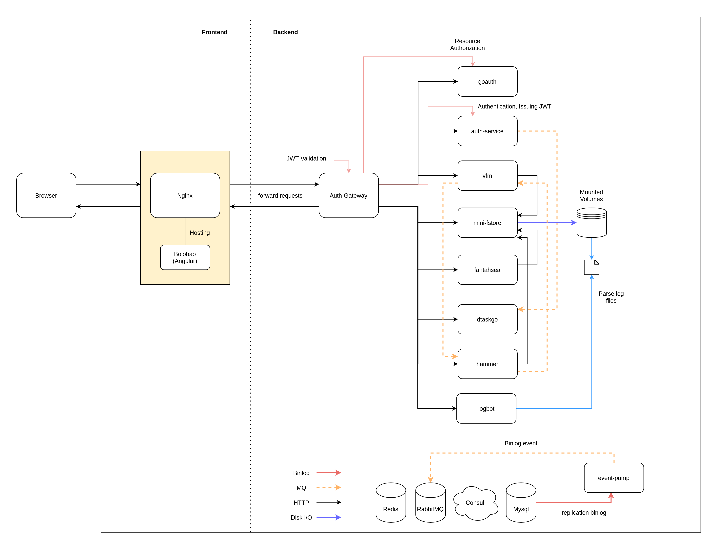
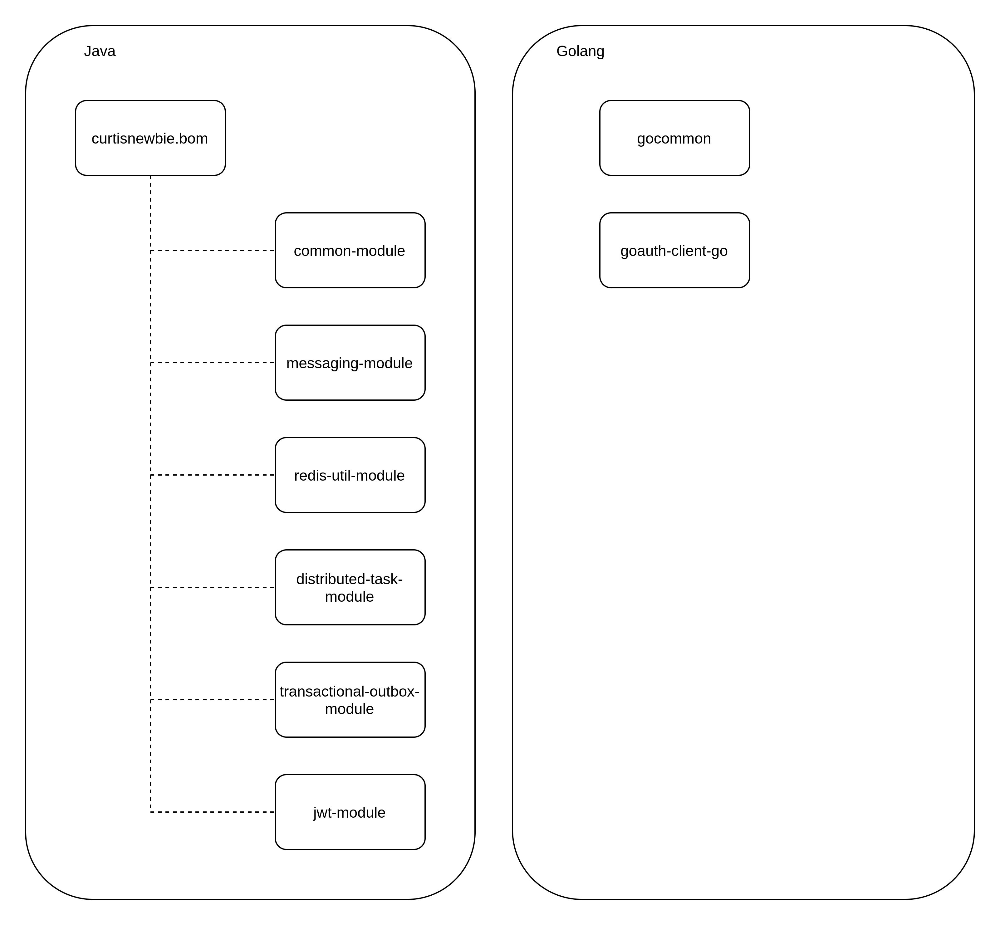
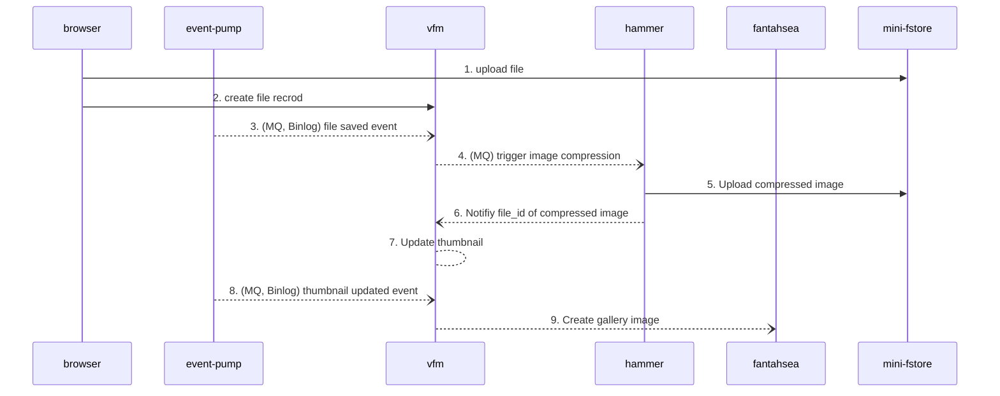
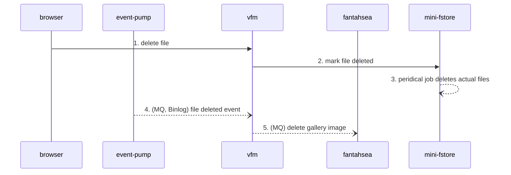

# system-overview

## Overall Achitecture

System Overview of my own projects.

## Modules Overview

## Event Pipelines Overview

### Upload File Event Pipelines

### Delete File Event Pipelines

